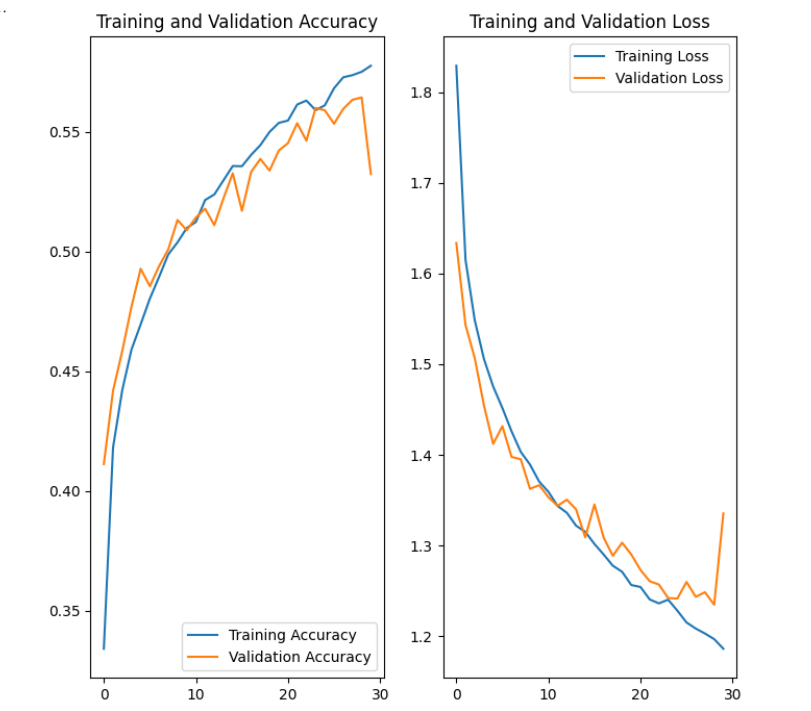
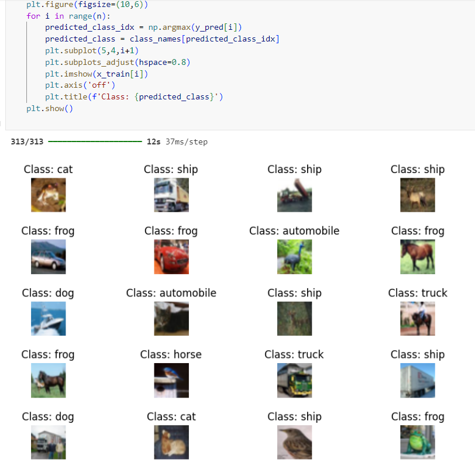

# Data Augmentation Deep Learning Model with Tensorflow and CIFAR-10

## A deep learning model that achieves 57% accuracy on the CIFAR-10 dataset with data augmentation techniques.

This project was built on Python3.12 using native Windows. Using a GPU-accelerated environment is advised as model training is a limitation of this project.

## Features
- Predicts image labels of blurried images from the CIFAR-10 dataset using data augmentation techniques using Keras built on Tensorflow.

## Requirements
- Python3.12
- Libraries listed in requirements.txt file
- (Optional) GPU-accelerated environment with CUDA

## Usage
- Run the code cells on Visual Studio Code ipykernel extension

## Considerations
- The model achieves a low accuracy and demonstrates overfitting in later epochs; dropout should be introduced, the number of training epochs should increase, and more data augmentation techniques can be implemented to increase the model performance.
- Model training was ran on the cpu and was extremely time-intensive as Tensorflow2.19 does not support GPU-acceration on Windows and going through the Nvidia installments was a hassle. Tensorflow should be installed with Ubuntu for proper GPU detection if using Windows WSL2.
